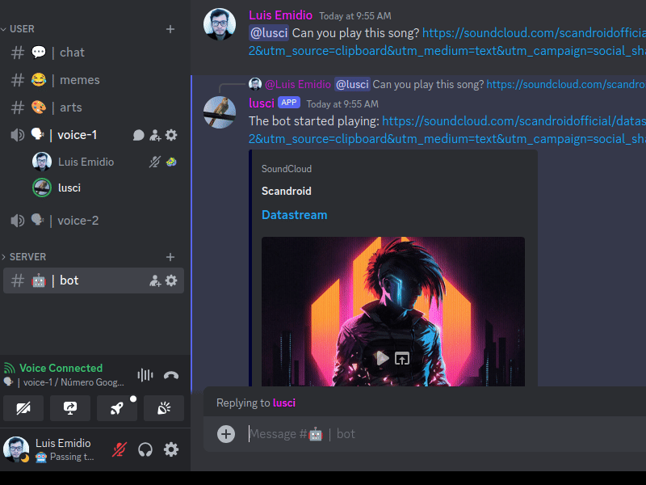

# Lusci

Lusci is a free and open-source Discord bot designed to enhance your server's music experience. With commands for playing, managing tracks, and checking bot information, Lusci brings music to your Discord community through natural language command interpretation.



## Key Features

- **Music Playback:** Stream music from SoundCloud, Bandcamp, Vimeo, Twitch streams, or any HTTP URLs seamlessly.
- **Jellyfin Integration:** Search and play songs directly from your private Jellyfin server.
- **Control Commands:** Pause/resume tracks, skip to the next song, adjust volume, or mute the bot as needed.

*Note: Lusci operates without a history function, focusing solely on executing natural language commands within Discord's bot environment.*

## Usage Instructions

Interacting with Lusci is intuitive:

- **Bot Invocation:** Ping the bot using `@lusci` to request actions, for example: `Hey @lusci, can you play this URL? https://soundcloud.com/scandroidofficial/datastream`.
- **Conversational Commands:** Reply to Lusci's messages directly for a seamless interaction experience.

## Installing

> [!NOTE]  
> Before installing Lusci, ensure you have the following prerequisites:
> 
> - **Docker**: Install Docker on your system. You can download Docker from [here](https://docs.docker.com/engine/install/).
> - **Docker Compose**: Ensure you have [Docker Compose](https://docs.docker.com/compose/install/) installed as well.

Follow these steps to install Lusci on your server:

- **Discord Bot Setup**: Create a Discord bot in the Discord Developer Portal at [discord.com/developers/applications](https://discord.com/developers/applications). Configure the necessary permissions and copy the bot token to be used in the `.env` file.

- **Gemini API Key**: Obtain a Gemini API key from Google AI Studio. [Get an API key](https://makersuite.google.com/app/apikey)

- **Download Installation Example:** Obtain the installation example from `./examples/install`.

- **Set Environment Variables:**
  - Create or update the `.env` with the required environment variables. Check the `.env.example` for guidance.

- **Launch Lusci:**
  Execute the following command in your terminal:

  ```bash
  docker compose up
  ```

  This command initiates Lusci's deployment on your Discord server.

## Updating

Ensure your Lusci bot is always up to date with the latest features and improvements by following these steps:

- **Run Update Script:**
  Execute the following command in your terminal:

  ```bash
  bash update.sh
  ```

  This script automatically updates Lusci to its latest version, ensuring optimal performance and access to new functionalities.

## Developer Guide

Checkout [CONTRIBUTING](CONTRIBUTING.md).
